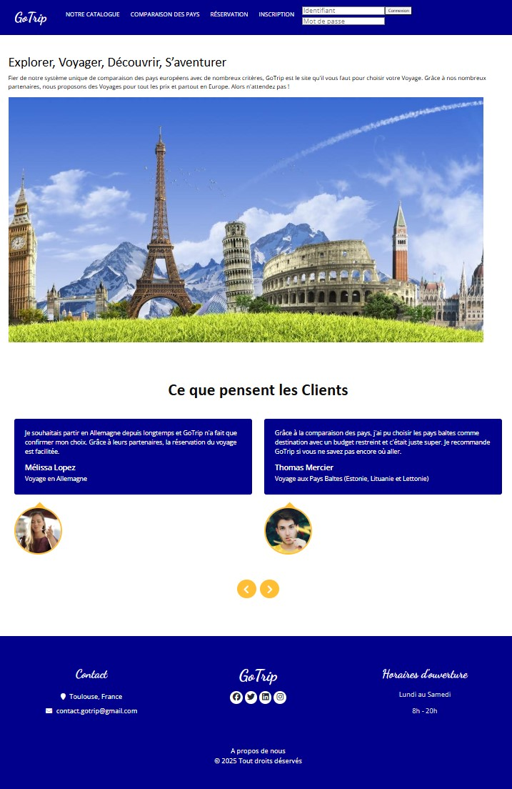
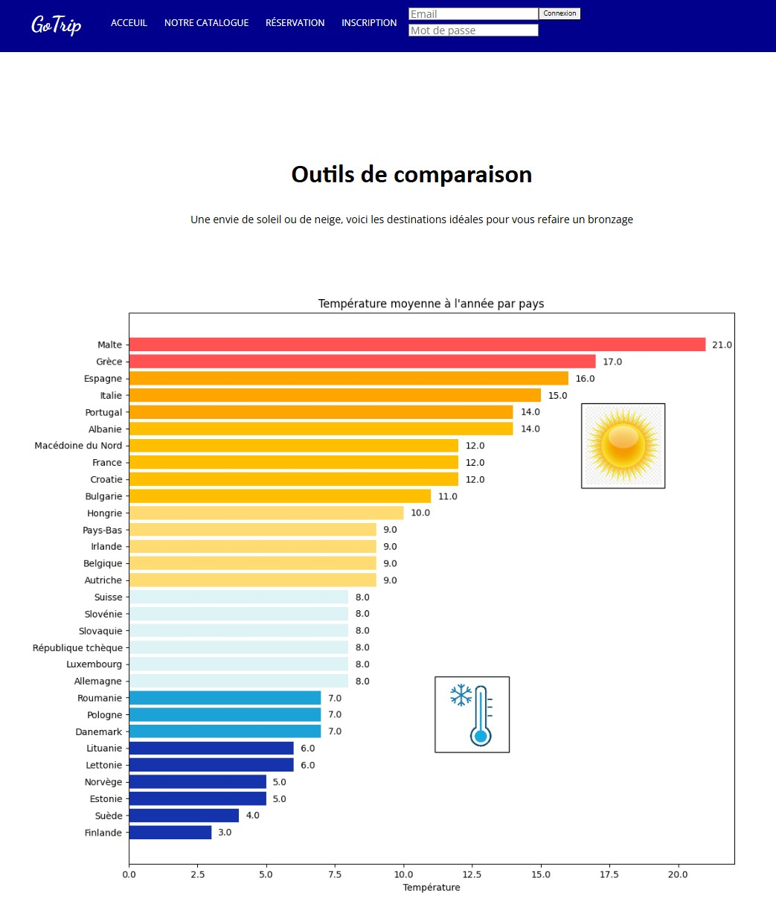

**Projet académique:**

* Télécharger le projet
* Exécuter sur le terminal les commandes suivantes >> Windows (cmd) :
  * Accédez au dossier :
      cd Downloads\GoTrip Projet\GoTrip Projet
  * Créer un environnement virtuel (optionnel mais recommandé) :
      python -m venv venv
  * Puis, activez-le :
      venv\Scripts\activate
  * Installez Flask manuellement :
      pip install flask
   * Installer aussi Matplotlib dans venv :
      pip install matplotlib
   * Installer scipy :
      pip install scipy
   * Installer pandas :
      pip install pandas
  * Lancez l'application :
      set FLASK_APP=app.py
      set FLASK_ENV=development
  * Démarrer le serveur Flask
      flask run

Projet GoTrip

GoTrip est une plateforme de voyage en ligne qui aide les visiteurs à trouver le road trip idéal en Europe, en fonction de leur budget et de leurs envies.

